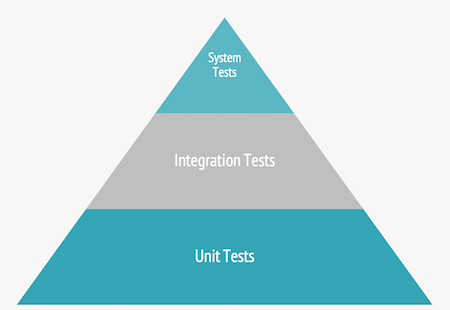

layout: true
class: center, middle, inverse
---

# An Introduction to Automated Testing with Behat

## By Rocco Palladino

---
layout: false
class: middle

.float-right[

]

# What is Behat?

.quote[
It's not a functional testing framework. And the reason behind that is that we are not testing functionality...Instead, with Behat, we are testing that applications fulfill business needs.<br>
			.float-right[&mdash;everzet, creator of Behat]
]
<br>
.footnote[Source: [Behat by Example, SymfonyLive Paris 2012](https://www.youtube.com/watch?v=QnPmbQbsTV0)]

---
class: middle

# Automated Testing

- Unit testing

- Integration testing

- System or end-to-end testing

- Acceptance testing

---

# Unit Testing

- Verifies a single behavior of a single unit (typically a function or method)

- A single unit is something that can be reasoned about in *isolation* and is completely under control of the developer (no dependencies you can't control)

- Should fail for one reason

```
// unit
function validateEmail($email) {
	return (bool) filter_var($email, FILTER_VALIDATE_EMAIL);
}

// unit tests
function itReturnsTrueForValidEmail() {
	expect(validateEmail('jsmith@example.com')->toBe(true);
}

function itReturnsFalseForInvalidEmail() {
	expect(validateEmail('jsmith#example.com')->toBe(false));
}
```
---

# Integration Testing

- Verifies behavior of units working together

- Focuses on the interface between components, including external components (e.g. a database, a web api)

- Failures indicate changes in API of one of the components

- Often slower than unit tests

```

// components working together (model class & database)
static function findByEmail($email) {
	return self::$db->query('select * from contacts where email = ?', $email);
}

// integration test
function itFindsContactByEmail() {
	$contact = new Contact();
	$contact->email = 'jsmith@example.com';
	$contact->name = 'John Smith';
	$contact->save();

	$contact = Contact::findByEmail('jsmith@example.com');
	expect($contact->name)->toBe('John Smith);
}
```

---

# System / End-to-End Testing

- Verifies system as a whole

- Includes UI, database, webserver, etc.

- Tests make calls at the outside boundary of the system and are verified at the same level

- Usually the slowest kind of test

```
function itCanAddAContact() {
	$newContact = Page::navigateTo('/contacts/new');
	$newContact->fill('#email', 'jsmith@example.com');
	$newContact->fill('#name', 'John Smith');
	$newContact->submit();

	$contactsIndex = Page::navigateTo('/contacts');
	$contacts = $contactsIndex->find('.contact-list .contact');
	expect($contacts[0]->find('.email'))->toBe('jsmith@example.com');
	expect($contacts[0]->find('.name'))->toBe('John Smith');
}
```

---

# The Testing Pyramid
<br>
.float-right[

]
<br>
- The ideal distribution of kinds of tests in a test suite

- Legacy code: introduce tests from top to bottom (i.e. start with system tests)

- Once system tests are in place, you can begin refactoring code into units.
---

# Acceptance Testing

- Verifies that a feature's requirements have been met

	- Does it meet the business requirements?

	- Is it ready for delivery?

	- Have we built the thing right? vs Have we built the right thing?

- Internal Acceptance Testing

	- Performed in-house, by using the system

	- Product, support, sales, QA

- External Acceptance Testing

	- User acceptance testing (Beta testing) performed by end users

- Automated Acceptance Testing

	- Does not replace internal or external testing, but augments it

---

# Behat

.float-right[
	
]

<br>
- A tool that supports acceptance test automation by linking together business requirement specifications with integration/system-level tests.

- Behat understands Gherkin, a domain-specific language used to express the business requirements of a feature through examples written in plain English.

- Behat uses PHP classes to translate Gherkin into executable tests.

---

# Gherkin spec or "feature"

```gherkin
Feature: Cash withdrawal

	In order to get money when the bank is closed
	As an Account Holder
	I need to withdraw cash from the ATM

 	Scenario: Account has sufficient funds
		Given I have deposited $100 in my account
		When I request $20
		Then $20 should be dispensed
```

# PHP step definitions

```
/**
 * @Given I have deposited $:amount in my account
 */
public function iHaveDepositedInMyAccount($amount)
{
	$this->myAccount()->deposit($amount);
	expect($this->myAccount()->balance)->toBe($amount);
}
```

---
# Gherkin spec or "feature"

```gherkin
Feature: Cash withdrawal

	In order to get money when the bank is closed
	As an Account Holder
	I need to withdraw cash from the ATM

 	Scenario: Account has sufficient funds
		Given I have deposited $100 in my account
		When I request $20
		Then $20 should be dispensed
```

## Anatomy of a feature

- Title

- Story

- Scenarios

- Steps


---
# Gherkin specs or "Features"

## Title

```
Feature: Cash withdrawal
```
<br><br>

- One line describing the story

- Some teams use the conventional form [Role Does Action], e.g. `Account holder withdraws cash`

- Title corresponds to file name, e.g., `cash_withdrawal.feature`

---

# Gherkin specs or "Features"

## Story

```gherkin
	In order to get money when the bank is closed
	As an Account Holder
	I need to withdraw cash from the ATM
```

- It is conventional to write stories in three lines as follows:

  - In order to [benefit]

  - As a [role]

  - I want/need [feature]

- If you can't express a feature of the application in these terms, you know something is amiss

---

# Gherkin specs or "Features"

## Scenario

```gherkin
 	Scenario: Account has sufficient funds
```

- Scenarios are the “body” of a feature, they’re the meat.

- A scenario describes the result of an attempt to use the feature under certain circumstances.

- The scenarios constitute the **acceptance criteria** of the feature.

- The scenarios for the `Cash withdrawal` feature might be:

```gherkin
	Scenario: Account has sufficient funds
	Scenario: Account has insufficient funds
```
---

# Gherkin specs or "Features"

## Steps

```gherkin
	Scenario: Account has sufficient funds
		Given I have deposited $100 in my account
		When I request $20
		Then $20 should be dispensed
```

- We generally write steps in the first person to make them clear and immediate.

- There are three main kinds of steps:
  - `Given` steps set the scene for the scenario.
  - `When` steps are the key action in the scenario.
  - `Then` steps describe the results we expect from the scenario
  -  `And` or `But` steps add or clarify conditions under `Given`, `When`, or `Then`
steps

---

# Gherkin specs or "Features"

## Steps: don't do this (but you will)

```gherkin
	Scenario: Successful ATM withdrawal
		Given I have an account
		And the account balance is $100
		And my ATM card has the pin 1234
		And the ATM contains $2000
		And I insert my ATM card
		And I enter 1234 in the "PIN" field
		When I press "withdrawal"
		And I enter $20 in the "amount" field
		And I press "enter"
		Then the ATM should dispense $20
		And my account balance should be $80
		And my ATM card should be returned
```

- Imperative style

- Very granular steps combined in a kind of transaction script

- Reference to UI: pressing buttons, entering input field values

---

# Gherkin specs or "Features"

## Steps: Do this instead

```gherkin
	Scenario: Successful ATM withdrawal
		Given my account balance is $100
		And my ATM card is valid
		And the ATM contains enough money
		When I request $20
		Then the ATM should dispense $20
		And my account balance should be $80
```

- Declarative style

- Just enough information to understand the business requirements of the feature

- No reference to a UI

- Express the feature using the language of the domain

---

# Step Definitions

```
/**
 * @Given I have deposited $:amount in my account
 */
public function iHaveDepositedInMyAccount($amount)
{
	$this->myAccount()->deposit($amount);
	expect($this->myAccount()->balance)->toBe($amount);
}

/**
 * @When I request $:amount
 */
public function iRequest($amount)
{
	$this->teller()->withdrawFrom($this->myAccount(), $amount);
}

/**
 * @Then $:amount should be dispensed
 */
public function shouldBeDispensed($amount)
{
	expect($this->cashSlot()->contents)->toBe($amount);
}
```
---

# Step Definitions

## Matcher annotation

```php
/**
 * @Given I have deposited :amount in my account
 */
```

- A pattern that matches a step with function to execute

- Step arguments identified with `:` prefix and passed as arguments to the function

- Behat will automatically generate snippets for you

- Use regular expressions to create more complex matching patterns

---

# Step Definitions

## Method

```
public function iHaveDepositedInMyAccount($amount)
{
	$this->myAccount()->deposit($amount);
	expect($this->myAccount()->balance)->toBe($amount);
}
```

- Just a regular PHP method on a `Context` class

- State can be shared between methods of the `Context` class

- Behat doesn't come with an assertion tool, but there are numerous assertion libraries you can use (e.g., bossa/phpspec2-expect)

---

# Expressive Scenarios

## Background

```gherkin
Feature: Change PIN

	Background:
		Given I have been issued a new card
		And I insert the card, entering the correct PIN
		And I choose "Change PIN" from the menu

	Scenario: Change PIN successfully
		When I change the PIN to 9876
		Then the system should remember my PIN is now 9876

	Scenario: Try to change PIN to the same as before
		When I try to change the PIN to the original PIN
		Then I should see a warning message
		And the system should not have changed my PIN
```

---

# Expressive Scenarios

## Data Tables

```gherkin
Given a User "Michael Jackson" born on August 29, 1958
And a User "Elvis" born on January 8, 1935
And a User "John Lennon" born on October 9, 1940
```

### Boring!

```gherkin
Given these Users:
	| name            | date of birth   |
	| Michael Jackson | August 29, 1958 |
	| Elvis           | January 9, 1935 |
	| John Lennon     | October 9, 1940 |
```

- Use with caution

- Data Tables != Database Tables

---

# Expressive Scenarios

## Data Tables

### Headings down the side (rows hash)

```gherkin

Then I should see a contact with the following details:
	| Name         | John Lennon         |
	| Email        | jlennon@example.com |
	| Organization | The Beatles         |
```

### A list

```gherkin

Then the contacts list should contain the emails:
	| mjackson@gmail.com |
	| elvis@aol.com      |
	| jlennon@yahoo.com  |
```

---

# Expressive Scenarios

## Scenario Outlines

```gherkin
Feature: Withdraw fixed amount

	Scenario: Withdraw fixed amount of $50
		Given I have $500 in my account
		When I choose to withdraw the fixed amount of $50
		Then I should receive $50 cash
		And the balance of my account should be $450

	Scenario: Withdraw fixed amount of $100
		Given I have $500 in my account
		When I choose to withdraw the fixed amount of $10
		Then I should receive $50 cash
		And the balance of my account should be $400

	Scenario: Withdraw fixed amount of $200
		Given I have $500 in my account
		When I choose to withdraw the fixed amount of $200
		Then I should receive $50 cash
		And the balance of my account should be $300
```

---

# Expressive Scenarios

## Scenario Outlines

```gherkin
Feature: Withdraw fixed amount

	Scenario Outline: Withdraw fixed amount
		Given I have <Balance> in my account
		When I choose to withdraw the fixed amount of <Withdrawal>
		Then I should receive <Received> cash
		And the balance of my account should be <Remaining>

		Examples:
			| Balance | Withdrawal | Received | Remaining |
			| $500    | $50        | $50      | $450      |
			| $500    | $100       | $100     | $400      |
			| $500    | $200       | $200     | $300      |
```

---
layout: true
class: center, middle, inverse
---

# Questions?

---
layout: false

# Resources

- http://behat.org/en/latest/quick_start.html

- http://blog.dannorth.net/whats-in-a-story/

- https://github.com/cucumber/cucumber/wiki/Cucumber-Backgrounder
